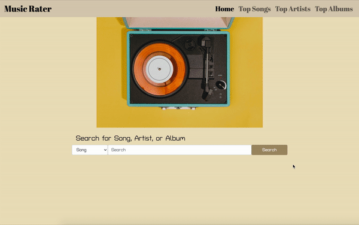

# Music Rater

Are you bored of listening to the same songs over and over again? When was the last time you changed up your playlist? Do you need some music diversity in your life?

[Music Rater](https://music-rater.herokuapp.com/ ) is the application just for you! Music Rater charts songs, artists, and albums from all users, and orders it by popularity. Come check out what other people are listening to, and maybe that will spice up your playlist that hasn't been updated since 2016.

## Description

Music Rater is an application that allows users to search for information about a song, artist, or album. The user can 'Like' a song, artist, or album, and that song, artitst, or album will be added to the corresponding Top Songs/Top Artists/Top Albums chart. The user can access the Top Songs, Top Artists, and Top Albums charts to see the most popular songs, artists, and albums for all our users.

**Deployed Link:** https://music-rater.herokuapp.com/ 

## Usage

Below is a quick demo that walks through our application. Check it out!

### Credits

Copyright 2020 © [Aaron Ray](https://github.com/aaray12), [Agnes Chueng](https://github.com/achueng), [Aida Blinstrubyte](https://github.com/aidabyte), [Jack Cushing](https://github.com/jcuush).